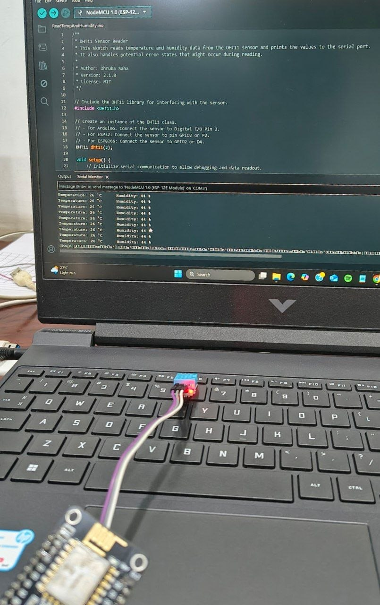

🌡️ ESP8266 DHT11 Temperature & Humidity Monitor

This project demonstrates how to interface a DHT11 Temperature and Humidity Sensor with an ESP8266 (NodeMCU) and display real-time sensor readings through the Serial Monitor.

The ESP8266 continuously reads temperature and humidity values from the DHT11 sensor and outputs them for monitoring, testing, and IoT development purposes.

---
## 📸 Project Gallery

### DHT11 Pin Configuration


### Components Required


### Serial Monitor Output


### Hardware Setup

## 🚀 Features

* Reads temperature in Celsius (°C)
* Reads relative humidity (%)
* Displays sensor data on Serial Monitor
* Handles sensor read errors
* Compatible with ESP8266 NodeMCU
* Simple and beginner-friendly

---

## 🧰 Hardware Requirements

* ESP8266 NodeMCU
* DHT11 Temperature & Humidity Sensor
* Jumper Wires
* Breadboard (Optional)
* USB Cable

---

## 💻 Software Requirements

* Arduino IDE
* ESP8266 Board Package
* DHT11 Library

---

## 🔌 Wiring Diagram

| DHT11 Pin | ESP8266 NodeMCU |
| --------- | --------------- |
| VCC       | 3V3             |
| GND       | GND             |
| DATA      | D4 (GPIO2)      |

---

## 📚 Required Library

Install the DHT11 library through the Arduino IDE Library Manager.

```cpp
#include <DHT11.h>
```

---

## ⚙️ How It Works

1. ESP8266 initializes serial communication.
2. DHT11 sensor is connected to GPIO2 (D4).
3. Temperature and humidity readings are collected.
4. Values are printed to the Serial Monitor.
5. Error messages are displayed if sensor communication fails.

---

## 📤 Example Output

```text
Temperature: 29 °C    Humidity: 68 %
Temperature: 30 °C    Humidity: 67 %
Temperature: 29 °C    Humidity: 69 %
```

---

## 📁 Project Structure

```text
ESP8266-DHT11-Monitor/
│
├── ESP8266_DHT11.ino
├── README.md
└── LICENSE
```

---

## ▶️ Getting Started

1. Install Arduino IDE.
2. Install ESP8266 Board Package.
3. Install the DHT11 library.
4. Connect the sensor according to the wiring table.
5. Upload the sketch to ESP8266.
6. Open Serial Monitor.
7. Set baud rate to 9600.
8. Observe temperature and humidity readings.

---

## 📊 Applications

* Weather Monitoring
* Smart Home Projects
* IoT Sensor Networks
* Greenhouse Monitoring
* Environmental Data Logging

---

## 📜 License

This project is licensed under the MIT License.

---

## 👨‍💻 Author

Aadinadhan R Nair

Electronics & IoT Enthusiast
